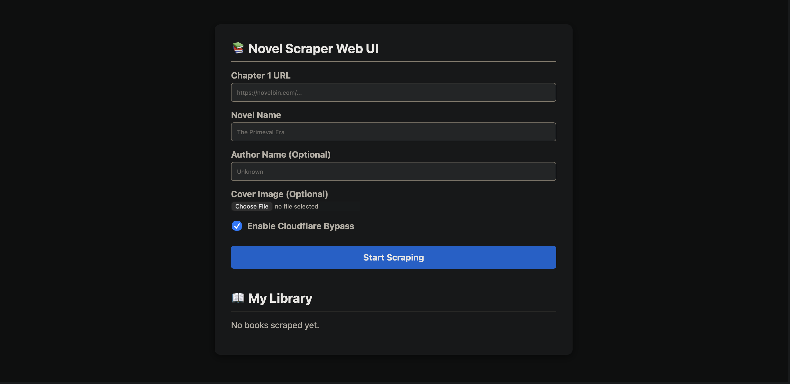

<div align="center">

# 📚 Universal Web Novel to EPUB Scraper


**A powerful web novel scraper that converts entire novels into beautifully formatted EPUB files.**

Built with **FastAPI + Botasaurus + EbookLib** and packaged in **Docker** for easy deployment.

</div>

---

# 📑 Table of Contents

- [Features](#-features)
- [Preview](#-preview)
- [Architecture](#-architecture)
- [Tech Stack](#-tech-stack)
- [Installation](#-installation)
  - [Method 1: Prebuilt Release](#method-1--prebuilt-release)
  - [Method 2: Docker Build](#method-2--docker-build)
  - [Method 3: Local Python Setup](#method-3--local-python-setup)
- [Usage](#-usage)
- [Configuration](#-configuration)
- [Troubleshooting](#-troubleshooting)
- [Roadmap](#-roadmap)
- [Contributing](#-contributing)
- [License](#-license)

---

# ✨ Features

### 🖥️ Web Dashboard
A modern **browser-based UI** to manage scraping jobs without touching the terminal.

### 🧠 Universal Scraping Engine
Automatically adapts to **different web novel layouts**, supporting many popular sites.

### 🛡️ Cloudflare Bypass
Uses **stealth Chromium automation** with human-like timing to bypass common protections.

### ⏳ Background Job Queue
Scraping tasks run in a **dedicated worker queue** to avoid memory overload and crashes.

### 🎨 Custom EPUB Covers
Upload a **cover image** and embed it into the generated EPUB.

### ✍️ Metadata Support
Add **author names, titles, and metadata** for cleaner ebook libraries.

### 📚 Persistent Download Library
All generated EPUB files are saved and accessible through the **web interface**.

---

# 📸 Preview



---

# 🏗️ Architecture

```
User Browser
      │
      ▼
 FastAPI Web API
      │
      ▼
 Job Queue System
      │
      ▼
 Botasaurus Scraper Worker
      │
      ▼
 Chapter Parser
      │
      ▼
 EPUB Generator (EbookLib)
      │
      ▼
 Download Library
```

---

# 🧰 Tech Stack

| Layer | Technology |
|------|-------------|
| Backend | FastAPI |
| Scraper | Botasaurus |
| EPUB Generator | EbookLib |
| Browser Automation | Chromium |
| Server | Uvicorn |
| Containerization | Docker |

---

# 📦 Installation

The **recommended method is Docker**.

---

# Method 1 — Prebuilt Release

If you downloaded the Docker image from the **GitHub Releases page**:

### Load Image

```bash
docker load -i novel-scraper-api.tar.gz
```

### Run Container

```bash
docker run -p 8000:8000 --shm-size="2g" novel-scraper-api
```

---

# Method 2 — Docker Build

### Clone Repository

```bash
git clone https://github.com/OsamaTab/Novel-Scraper.git
cd Novel-Scraper
```

### Build Image

```bash
docker build -t novel-scraper-api -f app/Dockerfile .
```

### Run Container

```bash
docker run -p 8000:8000 --shm-size="2g" novel-scraper-api
```

---

# Method 3 — Local Python Setup

### Enter App Directory

```bash
cd app
```

### Create Virtual Environment

Windows

```bash
python -m venv venv
venv\Scripts\activate
```

Mac/Linux

```bash
python3 -m venv venv
source venv/bin/activate
```

### Install Dependencies

```bash
pip install -r requirements.txt
```

### Start Server

```bash
uvicorn api:app --host 0.0.0.0 --port 8000
```

---

# 📖 Usage

1. Start the application.
2. Open your browser:

```
http://localhost:8000
```

3. Enter:

- URL of **Chapter 1**
- **Novel title**
- Optional **author name**
- Optional **cover image**

4. Click **Start Scraping**.

The system will:

- Crawl chapters
- Extract text
- Compile the book
- Generate a **downloadable EPUB**

---

# ⚙️ Configuration

Default server settings:

| Setting | Value |
|-------|------|
| Host | `0.0.0.0` |
| Port | `8000` |
| Browser | Headless Chromium |
| Queue Mode | Single worker |

These values can be modified in the application configuration files.

---

# ⚠️ Troubleshooting

### Cloudflare Blocking

Some sites deploy strong anti-bot protections.

Possible solutions:

- Retry later
- Use a VPN
- Allow the scraper time to slow down

Progress is **automatically saved**.

---

### Chromium Crashes

Always run Docker with:

```bash
--shm-size="2g"
```

Otherwise Chromium may fail during scraping.

---

### Architecture Issues

If building on **Apple Silicon (M-series)** but running on **Windows/Linux**, rebuild the Docker image on the target system.

---

# 🗺️ Roadmap

Planned improvements:

- [ ] Multi-worker scraping
- [ ] Automatic chapter discovery
- [ ] EPUB style themes
- [ ] WebSocket real-time progress updates
- [ ] User accounts and libraries
- [ ] Calibre integration
- [ ] CLI version

---

# 🤝 Contributing

Contributions are welcome.

If you'd like to help improve this project:

1. Fork the repository
2. Create a feature branch

```
git checkout -b feature/my-feature
```

3. Commit changes

```
git commit -m "Add new feature"
```

4. Push to GitHub

```
git push origin feature/my-feature
```

5. Open a Pull Request.

---

# 📜 Disclaimer

This project is intended for **personal and educational use only**.

Please respect:

- Website terms of service
- Copyright laws
- Server resources of the sites you scrape.

---

# ⚖️ License

Copyright © 2026 Osama

Licensed under **Creative Commons Attribution-NonCommercial 4.0 International (CC BY-NC 4.0)**.

You may:

✔ Use for personal projects  
✔ Modify the code  
✔ Share with attribution  

You may NOT:

❌ Sell the software  
❌ Use it in commercial services  

For **commercial licensing**, contact the author via GitHub.

---

# ⭐ Support the Project

If you find this project useful:

⭐ Star the repository  
🐛 Report issues  
💡 Suggest features  
🔧 Submit pull requests

It helps the project grow!